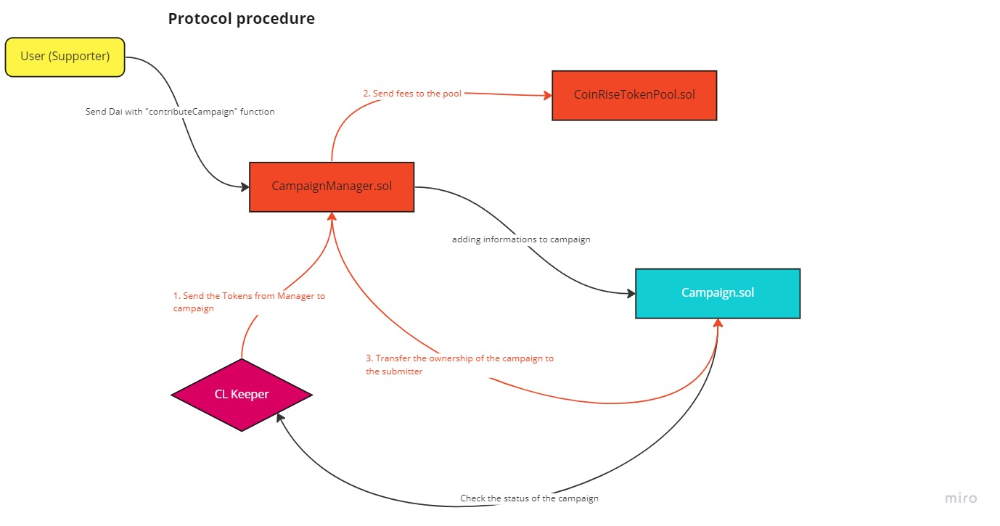
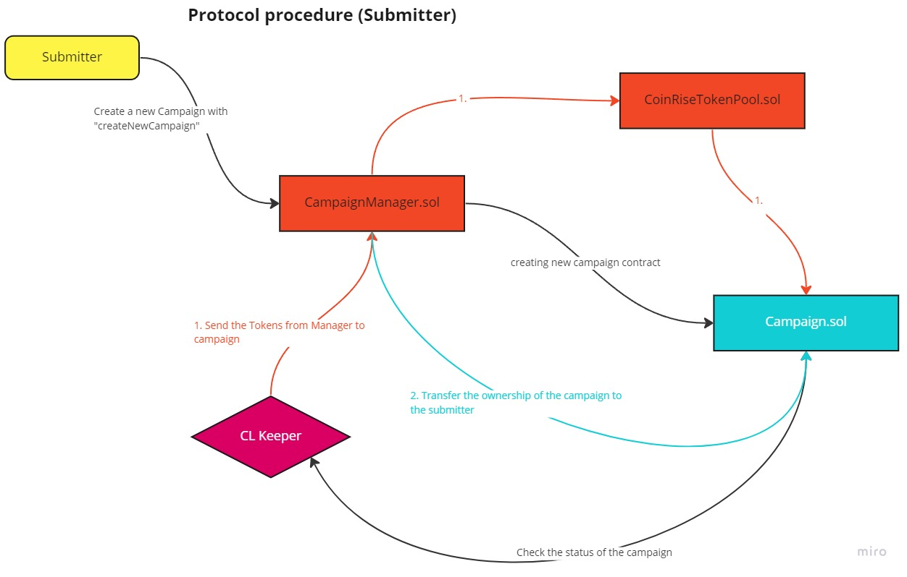

# Coin Rise Blockchain

crowdfunding platform with crypto for non-profit projects

the following graphic provides an overview of the project process

For the user:


For the submitter:


## Roadmap

-   Adding Featuers like yield generating or NFT's creation for contributors

## Environment Variables

To run this project, you will need to add the following environment variables to your .env file

`QUICKNODE_API_KEY_POLYGON`

`POLYGON_MUMBAI_API_KEY`

`PRIVATE_KEY`

`POLYGONSCAN_API_KEY`

`REPORT_GAS`

`COINMARKETCAP_API_KEY`

`FORKING_BLOCK_NUMBER`

`AUTO_FUND`

## Running Tests

To run tests, run the following command

```bash
  npm run test
```

or

```bash
  yarn test
```

To view the coverage of the smart contracts run

```bash
  npm run coverage
```

or

```bash
  yarn coverage
```

## Deployment

To deploy and verify all required smart contracts on my-network run

```bash
  npm run deploy --network my-network
```

or

```bash
  yarn deploy --network my-network
```

## Run local blockchain

For testing a front-end, it is possible to run a local blockchain and deploy all the necessary smart contracts. For testing run:

```bash
  npm run hardhat node --network hardhat
  npm run deploy --network localhost
```

or

```bash
  yarn hardhat node --network hardhat
  yarn deploy --network localhost
```

## Smart Contracts

All ABIs and addresses can be retrieved after deployment under "./deployments/deployedContracts.json".

Each campaign has its own smart contract. The addresses of the campaign can be found through the CampaignFactory.

In this section all necessary functions are listed to interact with the protcol.

1. CampaignManager

&emsp; `createNewCampaign`

&emsp; `contributeCampaign`

&emsp; `setFees`

&emsp; `calculateFees`

&emsp; `getFees`

&emsp; `getActiveCampaigns`

2. CampaignFactory

&emsp; `getDeployedCampaignContracts`

&emsp; `getLastDeployedCampaign`

3. Campaign "Clone"

&emsp; `transferStableTokens`

&emsp; `getEndDate`

&emsp; `getStartDate`

&emsp; `getDuration`

&emsp; `getSubmitter`

&emsp; `isFundingActive`

&emsp; `getRemainingFundingTime`

&emsp; `getContributor`

&emsp; `getNumberOfContributor`

&emsp; `getTotalSupply`

4. CoinRiseTokenPool

&emsp; `withdrawFreeStableTokens`

&emsp; `getLockedTotalStableTokenSupply`

&emsp; `getFreeTotalStableTokenSupply`

## Smart Contracts Mumbai Deployments

| Contracts             |                 Addresses                  |
| :-------------------- | :----------------------------------------: |
| Campaigns.sol         | 0xAa8ef6f8A1E04cA5fb55Acf99003188Ecab37886 |
| CampaignManager.sol   | 0x1D2C3DB58779F6cEC7e91BF12259a43ece338F97 |
| CampaignFactory.sol   | 0x2C44f76136f6cAfABe3E94A3e92D692642766eb0 |
| CoinRiseTokenPool.sol | 0x40d273fAE017991DFa76E3e13cf5801AaEA09306 |
