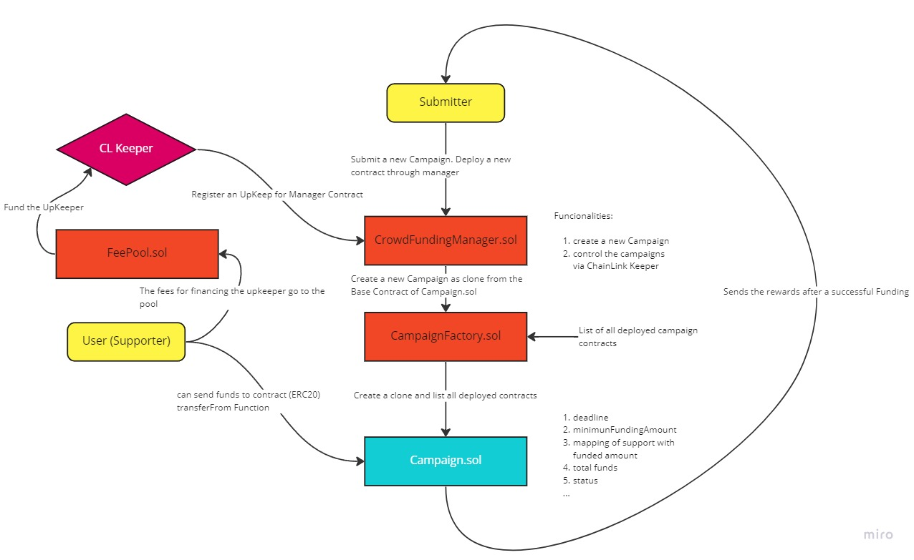

# Coin Rise Blockchain

crowdfunding platform with crypto for non-profit projects

the following graphic provides an overview of the project process



## Roadmap

-   Writing and finishing the Campaign.sol

-   Adding the ChainLink Keeper to CampaignManager.sol

## Environment Variables

To run this project, you will need to add the following environment variables to your .env file

`QUICKNODE_API_KEY_POLYGON`

`GOERLI_RPC_URL`

`PRIVATE_KEY`

`ALCHEMY_MAINNET_RPC_URL`

`REPORT_GAS`

`COINMARKETCAP_API_KEY`

`FORKING_BLOCK_NUMBER`

`AUTO_FUND`

`ETHERSCAN_API_KEY`

## Running Tests

To run tests, run the following command

```bash
  npm run test
```

or

```bash
  yarn test
```

## Deployment

To deploy and verify all required smart contracts on my-network run

```bash
  npm run deploy --network my-network
```

or

```bash
  yarn deploy --network my-network
```
